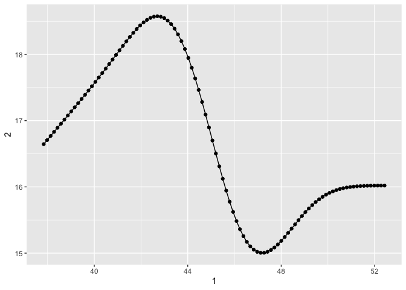
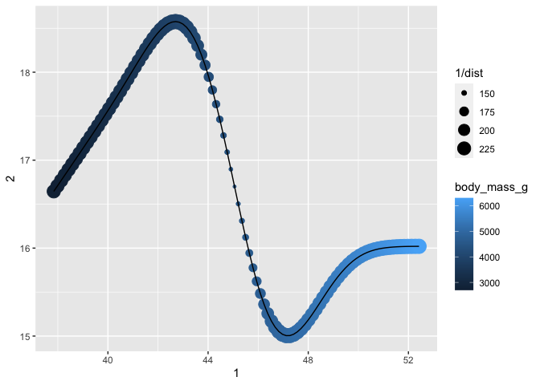
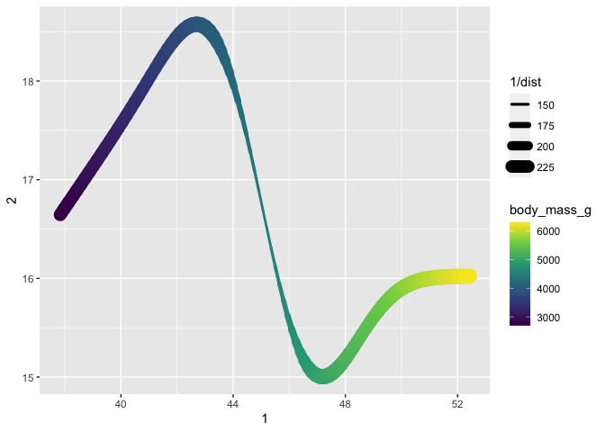
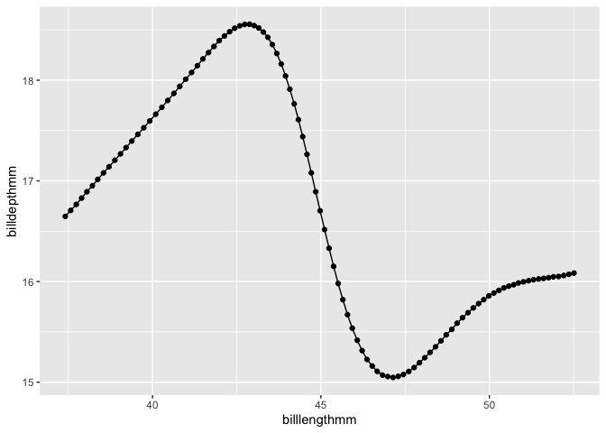
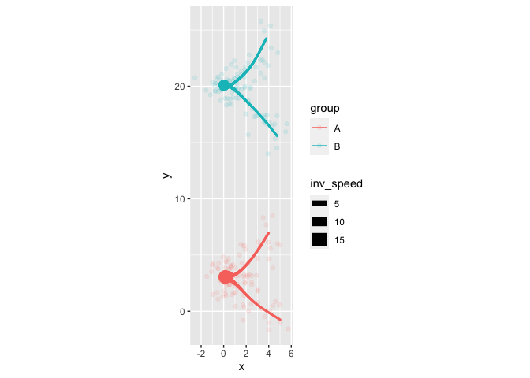
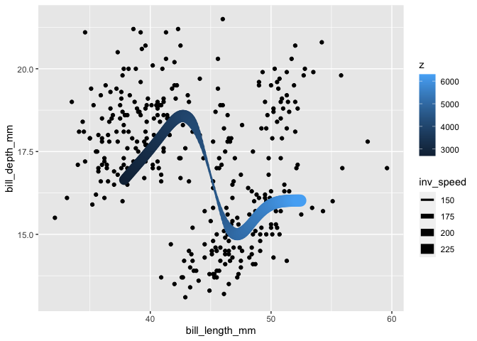
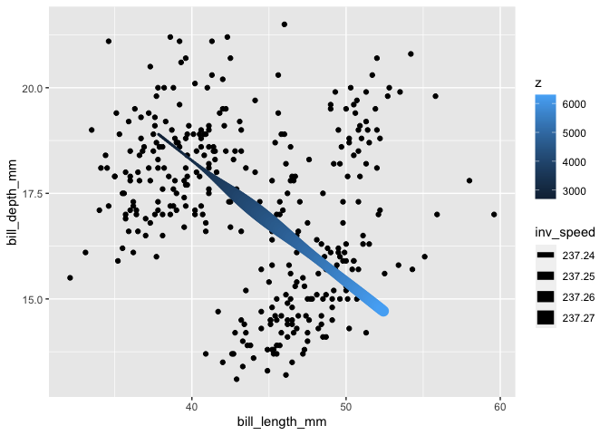

# Project Goals

## Goals

A package to generate wormy paths.

## How will it work?

### From data -\> plot

``` r
# not run
data |> 
  ggplot(aes(x, y, z))+
    stat_wormpath()
```

``` r
# not run 
data |> 
  ggplot(aes(x, y, z))+
    stat_wormpath(
      aes(color = z, 
          linewidth = after_stat(inv_dist)),
      method = mgcv,
      formula = list(x ~ s(z), y ~ s(z)),
      method.args = list(family = mvn(d=2))
    )
```

``` r
# not run 
data |> 
  ggplot(aes(x, y, z))+
    stat_wormpath(
      aes(color = z,
          linewidth = after_stat(inv_dist)),
      method = brms,
      formula = mvbind(x,y) ~ s(z) + set_rescor(TRUE),
      method.args = list(file = "ggplotfit", cores = 4)
      ## the file argument would have to be augmented to 
      ## reflect the grouping...
    )
```

``` r
# not run 
pre_computed |> 
  ggplot(aes(x, y, z = z))+
    geom_wormpath(
      aes(color = z,
          linewidth = inv_dist)
    )
```

### From model -\> plot

``` r
gam(
  list(
    x ~ s(z),
    y ~ s(z)
  ),
  data = data,
  family = mvn(d=2)
)->model

wormplot(
  model,
  variable = "z",
  n = 100
)
```

``` r
gam(
  list(
    x ~ s(z) + g,
    y ~ s(z) + g
  ),
  data = data,
  family = mvn(d=2)
)->model

wormplot(
  model,
  variable = "z",
  by = "g",
  n = 100
)
```

## Ideas

``` r
library(palmerpenguins)
library(mgcv)
```

    Loading required package: nlme

    This is mgcv 1.9-0. For overview type 'help("mgcv-package")'.

``` r
library(ggplot2)
library(marginaleffects)
```

    Warning: package 'marginaleffects' was built under R version 4.3.1

### with mgcv

``` r
gam(
  list(
    bill_length_mm ~ s(body_mass_g),
    bill_depth_mm ~ s(body_mass_g)
  ),
  data = penguins,
  family = mvn(d = 2)
)->model
```

``` r
predictions(model, 
            newdata = datagrid(body_mass_g = \(x){
              modelr::seq_range(x, n = 100)
            }
            )
) |> 
  as.data.frame() |> 
  dplyr::select(rowid, 
                group, 
                estimate) |> 
  tidyr::pivot_wider(names_from = "group", 
                     values_from = "estimate") |> 
  ggplot(aes(`1`, `2`))+
  geom_point()+
    geom_path()
```



``` r
mod_preds <- predictions(model,
                         newdata = datagrid(body_mass_g = \(x) {
                           modelr::seq_range(x, n = 100)
                         }
                         )
)
mod_slopes <- slopes(model, 
                     newdata = datagrid(body_mass_g = \(x){
                       modelr::seq_range(x, n = 100)
                     }
                     )
)
```

``` r
mod_slopes |> 
  as.data.frame() |> 
  dplyr::select(rowid, 
                group, 
                body_mass_g, 
                estimate) |> 
  tidyr::pivot_wider(names_from = "group",
                     values_from = "estimate") |> 
  dplyr::mutate(
    dist = sqrt(`1`^2 + `2`^2)
  ) |> 
  dplyr::select(rowid, dist) ->
  distances
```

``` r
mod_preds |> 
  as.data.frame() |> 
  dplyr::select(rowid, 
                group, 
                body_mass_g, 
                estimate) |> 
  tidyr::pivot_wider(names_from = "group", 
                     values_from = "estimate") |>
  dplyr::left_join(distances) |> 
  ggplot(aes(`1`, `2`))+
    geom_point(aes(size = 1/dist, color = body_mass_g))+
    geom_path()
```

    Joining with `by = join_by(rowid)`



``` r
mod_preds |> 
  as.data.frame() |> 
  dplyr::select(rowid, 
                group, 
                body_mass_g, 
                estimate) |> 
  tidyr::pivot_wider(names_from = "group",
                     values_from = "estimate") |>
  dplyr::left_join(distances) |> 
  ggplot(aes(`1`, `2`))+
    #geom_point(aes(size = 1/dist, color = body_mass_g))+
    geom_path(aes(linewidth = 1/dist,
                  color = body_mass_g),
              lineend = "round")+
    scale_color_viridis_c()
```

    Joining with `by = join_by(rowid)`



### with brms

``` r
library(brms)
```

    Warning: package 'brms' was built under R version 4.3.1

    Loading required package: Rcpp

    Loading 'brms' package (version 2.20.4). Useful instructions
    can be found by typing help('brms'). A more detailed introduction
    to the package is available through vignette('brms_overview').


    Attaching package: 'brms'

    The following objects are masked from 'package:mgcv':

        s, t2

    The following object is masked from 'package:stats':

        ar

``` r
brm(
  mvbind(bill_length_mm, bill_depth_mm) ~ s(body_mass_g),
  data = penguins,
  backend = "cmdstanr",
  file = "brm0",
  cores = 4
) ->
  brm0_mod
```

``` r
predictions(brm0_mod, 
            newdata = datagrid(body_mass_g = \(x){
              modelr::seq_range(x, n = 100)
            }
            )
) |> 
  as.data.frame() |> 
  dplyr::select(rowid, 
                group, 
                estimate) |> 
  tidyr::pivot_wider(names_from = "group", 
                     values_from = "estimate") |> 
  ggplot(aes(billlengthmm, billdepthmm))+
  geom_point()+
  geom_path()
```



## Sample

``` r
library(tibble)
library(dplyr)
```


    Attaching package: 'dplyr'

    The following object is masked from 'package:nlme':

        collapse

    The following objects are masked from 'package:stats':

        filter, lag

    The following objects are masked from 'package:base':

        intersect, setdiff, setequal, union

``` r
library(ggplot2)
library(ggdist)
```


    Attaching package: 'ggdist'

    The following objects are masked from 'package:brms':

        dstudent_t, pstudent_t, qstudent_t, rstudent_t

``` r
library(wormypath)

tibble(
  time = runif(100, -10, 10),
  x = rnorm(100, mean = (time^2)/20),
  y = rnorm(100, mean = ((-time^3)/200)+3),
  group = "A"
) -> df1

tibble(
  time = runif(100, -10, 10),
  x = rnorm(100, mean = (time^2)/20),
  y = rnorm(100, mean = ((-time^3)/200)+20),
  group = "B"
) -> df2


ggplot(
  data = bind_rows(df1, df2),
  aes(x = x, y = y, z = time, color = group)
)+
  geom_point(alpha = 0.1)+
  stat_wormpath(n = 300)+
  coord_fixed() 
```



``` r
library(palmerpenguins)
```

``` r
penguins |> 
  ggplot(aes(bill_length_mm, bill_depth_mm, z = body_mass_g))+
    geom_point()+
    stat_wormpath(aes(color = after_stat(z)))
```

    Warning: Removed 2 rows containing non-finite values (`stat_wormpath()`).

    Warning: Removed 2 rows containing missing values (`geom_point()`).



``` r
penguins |> 
  ggplot(aes(bill_length_mm, bill_depth_mm, z = body_mass_g))+
    geom_point()+
    stat_wormpath(aes(color = after_stat(z)),
                  formula = list(x ~ s(z), y ~ z))
```

    Warning: Removed 2 rows containing non-finite values (`stat_wormpath()`).

    Warning: Removed 2 rows containing missing values (`geom_point()`).


